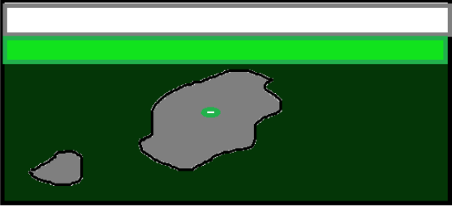
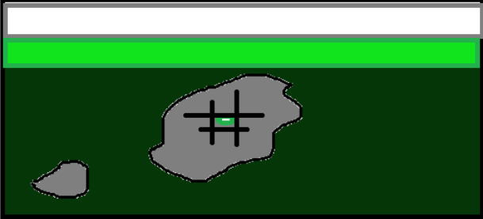

# Exercício 1

Matriz: mais semelhante a pastagem (grama)

Manchas (patches): As manchas em cinza que mostram a área de solo exposto

Corredores: A área de árvores



Grão inicial: palmeira no meio



Homogeneização


Parte 3: A árvore de dossel baixo

Na nova escala, o que era apenas uma árvore no meu desenho original agora é um complexo de organismos, um mini ecossistema. 


imagem de referência:


# Exercicío 2:

Arquivo do quarto.yml

project:
  type: website

website:
  title: "Ecologiaexercicio"
  navbar:
    left:
      - href: index.qmd
        text: Home
      - href: Aulas e exercicio.qmd
        text: Exercicios
      - about.qmd

format:
  html:
    theme:
      - cosmo
      - brand
    css: styles.css
    toc: true

editor: visual


# Exercício 3

```{r}
library("terra")
library("sf")
library("landscapemetrics")
library("tmap")
library("ggplot2")
library("vegan")
library("tidyverse")
library("rgbif")
library("geodata")
library("geobr")

cat("✓ Todos os pacotes carregados com sucesso!\n")

# Criar um raster de exemplo (paisagem simulada)

set.seed(42)
r <- rast(nrows = 50, ncols = 50,
           xmin = 0, xmax = 50, ymin=0, ymax = 50)

#simulação das classes de uso de solo

values(r) <- sample(1:4, ncell(r), replace = TRUE,
                    prob = c(0.50, 0.20, 0.20, 0.10))

#Classes usadas

levels(r) <- data.frame(
  id = 1:4,
  label = c("Floresta", "Pastagem", "Agricultura", "Água"))

#vizualização do que foi feito:

plot(r,
     col = c("darkgreen", "lightgreen", "orange", "lightblue"),
     main = "Paisagem simulada — uso do solo",
     mar     = c(3, 3, 2, 6))

# Informações do raster

print(r)          
# Dimensões, extensão, CRS
res(r)            
# Resolução espacial
ext(r)            
# Extensão geográfica
ncell(r)          
# Número total de células
freq(r)           
# Frequência de cada classe (tabela de área)

# Pacote SF (simple features)

# Criando a simulação de pontos
set.seed(7)
parcelas <- st_as_sf(
  data.frame(
    id        = 1:10,
    longitude = runif(10, 5, 45),
    latitude  = runif(10, 5, 45),
    riqueza   = rpois(10, lambda = 12)
  ),
    coords = c("longitude", "latitude"),
    crs    = NA   )


# Criando a forma de vizualizar sobre o RASTER

plot(r, col = c("darkgreen", "lightgreen", "orange", "lightblue"),
     main = "Parcelas sobre o mapa de uso do solo")
plot(st_geometry(parcelas), add = TRUE, pch = 21, 
     bg = "red", cex = 1.5)


### Usando o Landscapemetrics

library(landscapemetrics)
library(terra)

paisagem <- terra::rast(landscapemetrics::landscape)
check_landscape(paisagem)

plot(paisagem)

# métricas de fragmento

areas <- lsm_p_area(paisagem)
head(areas)

#isolamento

isolamento <- lsm_p_enn(paisagem)
head(isolamento)

# Proporção de cada classe na paisagem
proporcao <- lsm_c_pland(paisagem)
print(proporcao)

# Proporção de cada classe na paisagem
proporcao <- lsm_c_pland(paisagem)
print(proporcao)


#Total de borda por classe
borda <- lsm_c_te(paisagem)
print(borda)

# Índice de diversidade de Shannon
shannon <- lsm_l_shdi(paisagem)
print(shannon)

#Área total
area_total <- lsm_l_ta(paisagem)
print(area_total)


### Calculando mais de uma metrica no LSM

metricas <- calculate_lsm(
  paisagem,
  what = c(
    "lsm_l_ta",    # Área total
    "lsm_l_shdi",  # Diversidade de Shannon
    "lsm_l_pd",    # Densidade de fragmentos
    "lsm_c_pland", # Proporção de cada classe
    "lsm_c_np"     # Número de fragmentos por classe
  )
)

print(metricas)


# Visualizar fragmentos rotulados por classe
show_patches(paisagem, class = "all", labels = TRUE)
# Visualizar área de núcleo (interior dos fragmentos)
show_cores(paisagem, class = c(1, 2))

### Usando o TMAP

#Carregando os pacotes
library(tmap)
library(terra)

# Simulando uma paisagem para o mapa

set.seed(42)
r <- rast(nrows = 50, ncols = 50,
          xmin = -35.5, xmax = -35.0,
          ymin = -8.5,  ymax = -8.0,
          crs  = "EPSG:4326")
values(r) <- sample(1:4, ncell(r), replace = TRUE,
                    prob = c(0.50, 0.20, 0.20, 0.10))
levels(r) <- data.frame(
  id    = 1:4,
  label = c("Floresta", "Pastagem", "Agricultura", "Água")
)


# Usando o modo "view" ou de interação.
tmap_mode("view")  
tm_shape(r) +
  tm_raster(
    col.scale = tm_scale_categorical(
      values = c("darkgreen", "lightgreen", "orange", "lightblue")
    ),
    col.legend = tm_legend(title = "Uso do Solo")
  ) +
  tm_title("Paisagem Simulada — Pernambuco") +
  tm_scalebar()


# Usando o modo estático, ou para publicações

tmap_mode("plot")

tm_shape(r) +
  tm_raster(
    col.scale = tm_scale_categorical(
      values = c("darkgreen", "lightgreen", "orange", "lightblue")
    ),
    col.legend = tm_legend(title = "Uso do Solo")
  ) +
  tm_title("Paisagem Simulada") +
  tm_scalebar(position = c("left", "bottom")) +
  tm_compass(position = c("right", "top"))


### Utilizando o Vegan.

#carregando o pacote
library(vegan)

# Simulando uma matriz de  abundância (sites × espécies)
set.seed(99)
comunidades <- matrix(
  rpois(10 * 20, lambda = c(rep(5, 100), rep(1, 100))),
  nrow = 10, ncol = 20,
  dimnames = list(
    paste0("Site_", 1:10),
    paste0("Sp_",   1:20)
  )
)

comunidades

# Estimando a Alfa simulada

div_shannon <- diversity(comunidades, index = "shannon")
div_simpson <- diversity(comunidades, index = "simpson")
riqueza     <- specnumber(comunidades)

resultados_div <- data.frame(
  site      = rownames(comunidades),
  riqueza   = riqueza,
  shannon   = round(div_shannon, 3),
  simpson   = round(div_simpson, 3)
)

print(resultados_div)

# Ordenando, usando o Non-Metric Multidimensional Scaling

nmds <- metaMDS(comunidades, distance = "bray", 
                trymax = 50, trace = FALSE)

cat("Stress do NMDS:", round(nmds$stress, 3), "\n")

# Stress < 0.1 = excelente; < 0.2 = bom; > 0.3 = problemático

# Visualizar
plot(nmds, type = "t", main = "NMDS — Composição de Comunidades")

```


