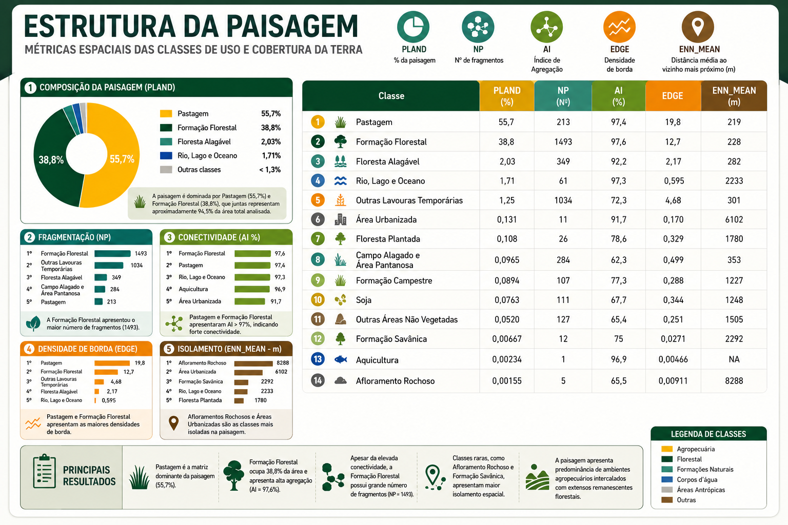
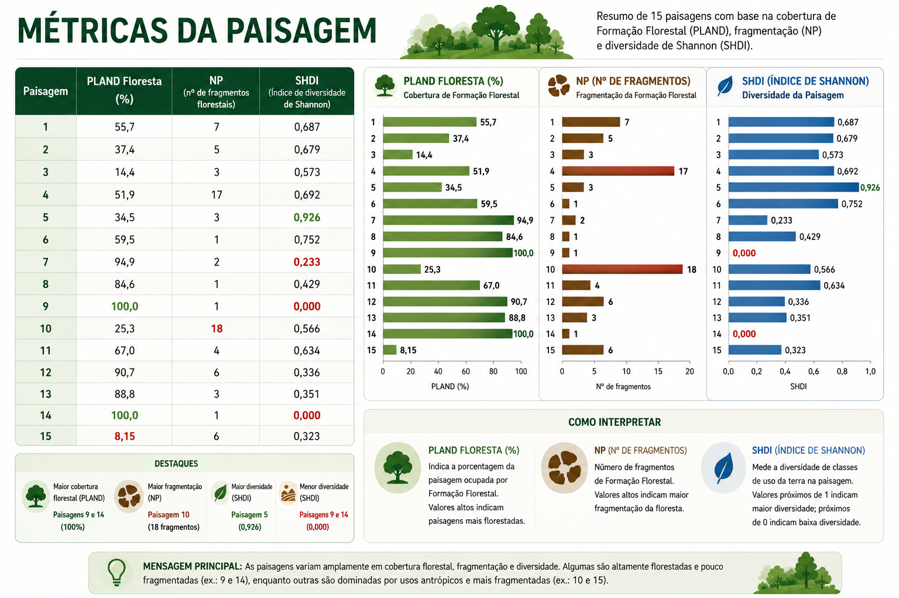
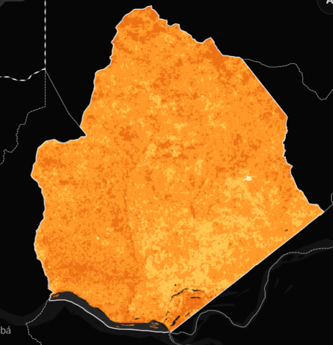
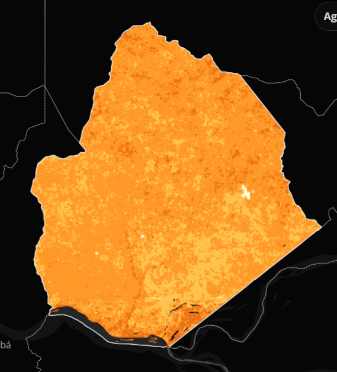
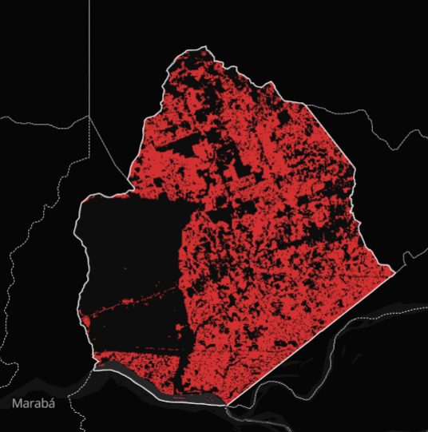
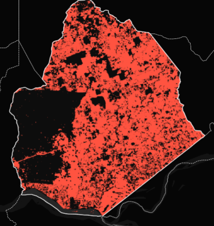
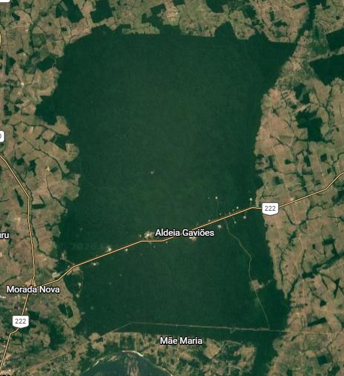

# Parte 1: Análise Descritiva da Paisagem

## Escolha do munpicipio

O município escolhido para avaliação foi "Bom Jesus do Tocantins (PA)". Importante não confundir com um município de mesmo nome no estado do Tocantins. A escolha se deu por conta do histórico do município. Nele existe a TI Mão Maria, terra indigena habitada pelos povos Gavião Akrãtikatêjê, Gavião Kykatejê, Gavião Parkatêjê e Guarani ( Guarani Mbya ); contando com um grande histórico de lutas e disputas. O município já foi vitíma do chamado "arco do desmatamento", que tranformou sua paisagem por completo. Como vamos ver a seguir, o munícipio teve sua composição e configuração completamente modificadas.

## Dados e processamento

Os rasters foram obtidos através da Plataforma MapBiomas, na coleção 10. Foram utilizados dois Rasters para Bom Jesus do Tocantins (PA). O principal para as análises é de 2024 (último ano disponivel na atual data), o segundo é de 1985, o raster mais antigo diponível, servindo de comparação com o atual.

### Carregando os Pacotes e Rasters

```{r}
# Carregando os pacotes necessários 

library("terra")
library("sf")
library("landscapemetrics")
library("tmap")
library("ggplot2")
library("vegan")
library("tidyverse")
library("rgbif")
library("geodata")
library("geobr")
library("tidyterra")
library("dplyr")

cat("✓ Todos os pacotes carregados com sucesso!\n")

# Carregando o Raster de Bom Jesus do Tocantins (PA)
mun_2024 <- rast("toca_2024.tif")
# Carregando o Raster de Bom Jesus do Tocantins (PA) 1985
mun_1985 <- rast("toca_1985.tif")


```

Com os Rasters carregados, podemos seguir para as configurações.

```{r}
# Buscando dados do IBGE
geobr::read_municipality(1501576)

# Configurando coordenadas (Lat-long --> metros)
mun_2024_utm <- project(mun_2024, "EPSG:31982", method = "near")

# Verficando configuração
print(mun_2024_utm)

# Identificando 
unique(mun_2024_utm)
```

Para 1985

```{r}
# Configurando coordenadas (Lat-long --> metros)
mun_1985_utm <- project(mun_1985, "EPSG:31982", method = "near")

# Verficando configuração
print(mun_1985_utm)

# Identificando 
unique(mun_1985_utm)
```

## Mapa de cobertura

Agora podemos plotar os gráficos e vizualizar o município.

```{R}
# criando legendas e definindo cores
legenda <- data.frame(
  value = c(3,4,6,9,11,12,15,24,25,29,31,33,39,41),
  label = c(
    "Formação Florestal",
    "Formação Savânica",
    "Floresta Alagável",
    "Floresta Plantada",
    "Campo Alagado e Área Pantanosa",
    "Formação Campestre",
    "Pastagem",
    "Área Urbanizada",
    "Outras Áreas Não Vegetadas",
    "Afloramento Rochoso",
    "Aquicultura",
    "Rio, Lago e Oceano",
    "Soja",
    "Outras Lavouras Temporárias"
  )
)
cores <- c(
  "#1f8d49", # 3  Formação Florestal
  "#7dc975", # 4  Formação Savânica
  "#04381d", # 6  Floresta Alagável
  "#7a5900", # 9  Floresta Plantada
  "#519799", # 11 Campo Alagado e Área Pantanosa
  "#d6bc74", # 12 Formação Campestre
  "#edde8e", # 15 Pastagem
  "#d4271e", # 24 Área Urbanizada
  "#db4d4f", # 25 Outras Áreas Não Vegetadas
  "#ffaa5f", # 29 Afloramento Rochoso
  "#9c0027", # 31 Aquicultura
  "#2532e4", # 33 Rio, Lago e Oceano
  "#f5b3c8", # 39 Soja
  "#ffefc3"  # 41 Outras Lavouras Temporárias
)
legenda$Cor <- cores
levels(mun_2024_utm) <- legenda[,1:2]

# Vendo o resultado 
ggplot() +
  geom_spatraster(data = mun_2024_utm) +
  scale_fill_manual(values = cores, na.value = "transparent") +
  labs(title = "Bom Jesus do Tocantins 2024") +
  theme_minimal()

```

Para 1985

```{R}
legenda1985 <- data.frame(
  value = c(3,4,6,9,11,12,15,24,25,29,31,33,39,41),
  label = c(
    "Formação Florestal",
    "Formação Savânica",
    "Floresta Alagável",
    "Floresta Plantada",
    "Campo Alagado e Área Pantanosa",
    "Formação Campestre",
    "Pastagem",
    "Área Urbanizada",
    "Outras Áreas Não Vegetadas",
    "Afloramento Rochoso",
    "Aquicultura",
    "Rio, Lago e Oceano",
    "Soja",
    "Outras Lavouras Temporárias"
  )
)
cores1985 <- c(
  "Formação Florestal" = "#1f8d49",
  "Formação Savânica" = "#7dc975",
  "Floresta Alagável" = "#04381d",
  "Floresta Plantada" = "#7a5900",
  "Campo Alagado e Área Pantanosa" = "#519799",
  "Formação Campestre" = "#d6bc74",
  "Pastagem" = "#edde8e",
  "Área Urbanizada" = "#d4271e",
  "Outras Áreas Não Vegetadas" = "#db4d4f",
  "Afloramento Rochoso" = "#ffaa5f",
  "Aquicultura" = "#9c0027",
  "Rio, Lago e Oceano" = "#2532e4",
  "Soja" = "#f5b3c8",
  "Outras Lavouras Temporárias" = "#ffefc3"
)
legenda1985$Cor1985 <- cores1985
levels(mun_1985_utm) <- legenda1985[,1:2]

# Vendo o resultado 1985
ggplot() +
  geom_spatraster(data = mun_1985_utm) +
  scale_fill_manual(values = cores1985, na.value = "transparent") +
  labs(title = "Bom Jesus do Tocantins 1985") +
  theme_minimal()
```

Podemos observar que o municipio perdeu grande parte de sua vegetação nativa, sendo convertido em maior parte por pasto.

## Métricas de paisagem

Podemos prosseguir para as análises de paisagem, seguindo o modelo Landscape, Class e Patch.

Começando com o checklandscape

```{r}
check_landscape(mun_2024_utm)
check_landscape(mun_1985_utm)
```

Diversidade de Shannon e Área total

```{r}
# Métricas para Landscape (paisagem)
# diversidade 
shannon <- lsm_l_shdi(mun_2024_utm)
head(shannon)
# Área total
area_total <- lsm_l_ta(mun_2024_utm)
print(area_total)

```

Para 1985

```{r}
# Métricas para Landscape (paisagem) 1985
shannon1985 <- lsm_l_shdi(mun_1985_utm)
head(shannon1985)

```

É possível observar que a diversidade é maior na paisagem atual, fruto do desmatamento e conversão do uso de terra. Em 1985 a paisagem também possuia muita diversidade, mas sua heterogeneidade vinha da diversidade de vegetações nativas. Dessa forma, podemos atestar que mesmo com indices de diversidade próximos, a composição da paisagem foi muito afetada, pois o que compões mudou muito.

Podemos ver isso melhor com as métricas para Classe

Proporção:

```{r}
  # Métricas para class (classe) 
# Proporção de cada classe
proporcao <- lsm_c_pland(mun_2024_utm)
print(proporcao)
### Criando tabela 
legendatab <- c(
  "3"  = "Formação Florestal",
  "4"  = "Formação Savânica",
  "6"  = "Floresta Alagável",
  "9"  = "Floresta Plantada",
  "11" = "Campo Alagado e Área Pantanosa",
  "12" = "Formação Campestre",
  "15" = "Pastagem",
  "24" = "Área Urbanizada",
  "25" = "Outras Áreas Não Vegetadas",
  "29" = "Afloramento Rochoso",
  "31" = "Aquicultura",
  "33" = "Rio, Lago e Oceano",
  "39" = "Soja",
  "41" = "Outras Lavouras Temporárias"
)

proporcao_tab <- proporcao %>%
  mutate(classe_nome = legendatab[as.character(class)]) %>%
  select(classe_nome, value) %>%
  rename(
    Classe = classe_nome,
    PLAND = value
  ) %>%
  arrange(desc(PLAND))

proporcao_tab
```

Agregação

```{r}
agregacao <- lsm_c_ai(mun_2024_utm)
print(agregacao)

agregacao_tab <- agregacao %>%
  mutate(
    classe_nome = legendatab[as.character(class)]
  ) %>%
  select(
    classe_nome,
    value
  ) %>%
  rename(
    Classe = classe_nome,
    AI = value
  ) %>%
  arrange(desc(AI))

agregacao_tab
```

Borda por classe:

```{r}
# Borda por CLASSE
borda <- lsm_c_te(mun_2024_utm)
print(borda)

#criando tabela
borda_tab <- borda %>%
  mutate(
    classe_nome = legendatab[as.character(class)]
  ) %>%
  select(
    classe_nome,
    value
  ) %>%
  rename(
    Classe = classe_nome,
    Borda_m = value
  ) %>%
  arrange(desc(Borda_m))

borda_tab

```

Para 1985

```{r}
  # Métricas para class (classe) 1985
# Proporção de cada classe 1985
proporcao1985 <- lsm_c_pland(mun_1985_utm)
print(proporcao1985)
### Criando tabela 
legendatab1985 <- c(
  "3"  = "Formação Florestal",
  "4"  = "Formação Savânica",
  "6"  = "Floresta Alagável",
  "9"  = "Floresta Plantada",
  "11" = "Campo Alagado e Área Pantanosa",
  "12" = "Formação Campestre",
  "15" = "Pastagem",
  "24" = "Área Urbanizada",
  "25" = "Outras Áreas Não Vegetadas",
  "29" = "Afloramento Rochoso",
  "31" = "Aquicultura",
  "33" = "Rio, Lago e Oceano",
  "39" = "Soja",
  "41" = "Outras Lavouras Temporárias"
)

proporcao_tab1985 <- proporcao1985 %>%
  mutate(classe_nome = legendatab1985[as.character(class)]) %>%
  select(classe_nome, value) %>%
  rename(
    Classe = classe_nome,
    PLAND = value
  ) %>%
  arrange(desc(PLAND))

proporcao_tab1985

```

Borda

```{r}
  
# Borda por CLASSE 1985
borda1985 <- lsm_c_te(mun_1985_utm)
print(borda1985)

#criando tabela
borda_tab1985 <- borda1985 %>%
  mutate(
    classe_nome = legendatab1985[as.character(class)]
  ) %>%
  select(
    classe_nome,
    value
  ) %>%
  rename(
    Classe = classe_nome,
    Borda_m = value
  ) %>%
  arrange(desc(Borda_m))

borda_tab

```

Podemos perceber uma grande diferença na composição da paisagem através da comparção de proporções. Atualmente a maior parte do municipio é composta por Pasto, enquanto em 1985 a maior parte era de vegetação nativa, principalmente de formação florestal.

O nível de borda também aumentou bastante com o desmatamento. Possuímos vários fragmentos pequenos com grandes efeitos de borda, como vamos ver a seguir

Analisando a nível de Patches (fragmentos)

Áreas

```{r}

# Métricas para Patch (Nivel de Fragmentos)
# Área dos fragmentos
areas <- lsm_p_area(mun_2024_utm)
head(areas)
### Criando tabela 

areas %>%
  mutate(
    classe_nome = "Formação Florestal"
  ) %>%
  select(
    classe_nome,
    id,
    value
  ) %>%
  rename(
    Classe = classe_nome,
    Fragmento = id,
    Area = value
  )
```

Metricas exclusivas para Classe florestal

```{r}
# Métricas para classe florestal
areas %>%
  filter(class == 3) %>%
  summarise(
    area_total = sum(value),
    n_fragmentos = n(),
    maior_fragmento = max(value)
  )

```

Distância pro vizinho mais próximo

```{r}
# Distância para o vizinho mais próximo
isolamento <- lsm_p_enn(mun_2024_utm)
head(isolamento)

```

Para 1985

```{r}
# Métricas para Patch (Nivel de Fragmentos)1985
# Área dos fragmentos1985
areas1985 <- lsm_p_area(mun_1985_utm)
head(areas1985)
### Criando tabela 

areas1985 %>%
  mutate(
    classe_nome = "Formação Florestal"
  ) %>%
  select(
    classe_nome,
    id,
    value
  ) %>%
  rename(
    Classe = classe_nome,
    Fragmento = id,
    Area1985 = value
  )

```

Classe florestal

```{r}
# Métricas para classe florestal
areas1985 %>%
  filter(class == 3) %>%
  summarise(
    area_total1985 = sum(value),
    n_fragmentos = n(),
    maior_fragmento = max(value)
  )


```

Distância para o vizinho mais próximo

```{r}
# Distância para o vizinho mais próximo
isolamento1985 <- lsm_p_enn(mun_1985_utm)
head(isolamento1985)

```

Percebemos que a configuração muda bastante com o passar dos anos. Atualmente temos uma paisagem com um grande fragmento, mantido por conta de uma TI. Esse grande fragmento é cortado por uma estrada de ferro e se encontra próximo de outros fragmentos pequenos. À medida que saimos de perto do fragmento 1, a conectividade diminui e o tamanho dos fragmentos também.

A distância entre alguns fragmentos é bem grande, o que pode ser uma barreira para muitos organismos.

Em 1985 Temos fragmentos muito maiores, com uma maior conectividade, falando apenas da formação florestal. O fragmento 1 (a TI) é muito maior e mais bem conectado a todos os outros. A fragmentação e os efeitos de borda são menores. A paisagem é um pouco mais homogenea, por conta da grande cobertura florestal

Tabela final de métricas

```{r}
#Tabelas finais

#Tabela final paisagem completa

pland <- lsm_c_pland(mun_2024_utm)
np <- lsm_c_np(mun_2024_utm)
ai <- lsm_c_ai(mun_2024_utm)
edge <- lsm_c_ed(mun_2024_utm)
enn <- lsm_c_enn_mn(mun_2024_utm)


library(purrr)

tabela_2024 <- reduce(
  list(
    pland %>% select(class, value) %>% rename(PLAND = value),
    np %>% select(class, value) %>% rename(NP = value),
    ai %>% select(class, value) %>% rename(AI = value),
    edge %>% select(class, value) %>% rename(EDGE = value),
    enn %>% select(class, value) %>% rename(ENN_MEAN = value)
  ),
  full_join,
  by = "class"
) %>%
  mutate(
    Classe = legendatab[as.character(class)]
  ) %>%
  select(
    Classe,
    PLAND,
    NP,
    AI,
    EDGE,
    ENN_MEAN
  ) %>%
  arrange(desc(PLAND))

print(tabela_2024)

```




### Sorteio de pontos

Aqui faremos um sorteio de 15 pontos dentro do Raster de 2024, visando obter, aleatoriamente, 15 buffers de 1500m. Através desses buffers, podemos realizar uma amostragem aleatória da paisagem.

```{r}
# Realizando o sorteio de pontos
# 15 pontos em 2024
# Definindo área de sorteio 
vetor_total <- as.polygons(mun_2024_utm, dissolve = TRUE)
municipio_limite <- aggregate(vetor_total)
limite_seguro <- buffer(municipio_limite, width = -2000)

floresta <- vetor_total[vetor_total$label == "Formação Florestal", ]
area_sorteio <- crop(floresta, limite_seguro)

if (is.list(area_sorteio)) {
  area_sorteio <- do.call(rbind, area_sorteio)
}

if (nrow(area_sorteio) == 0) {
  stop("Erro: Nenhuma floresta encontrada a mais de 1km da borda.")
}

# Definindo distância minima de 2000m e sorteando pontos

set.seed(1)
pontos_finais <- NULL
tentativas <- 0

while(is.null(pontos_finais) || nrow(pontos_finais) < 15) {
  tentativas <- tentativas + 1
  cand <- spatSample(area_sorteio, size = 1, method = "random")
  
  if (nrow(cand) > 0) {
    if (is.null(pontos_finais)) {
      pontos_finais <- cand
    } else {
      dists <- distance(cand, pontos_finais)
      if (min(dists) >= 2000) { 
        pontos_finais <- rbind(pontos_finais, cand)
      }
    }
  }
  
  if (tentativas > 5000) break
}

# Aplicando buffers
# Verificar CRS
if (!identical(crs(pontos_finais), crs(mun_2024_utm))) {
  pontos_finais <- project(pontos_finais, crs(mun_2024_utm))
}

buffers <- buffer(pontos_finais, width = 1500)
buffers$id_paisagem <- 1:nrow(buffers)

# Extração e processamento
extracao <- terra::extract(mun_2024_utm, buffers)
nome_col_raster <- names(extracao)[2]

tabela_final <- extracao %>%
  rename(id_buffer = ID, categoria_bruta = !!sym(nome_col_raster)) %>%
  group_by(id_buffer) %>%
  mutate(total_px = n()) %>%
  group_by(id_buffer, categoria_bruta) %>%
  summarise(
    pixels = n(),
    percentagem = (pixels / first(total_px)) * 100,
    .groups = "drop"
  ) %>%
  mutate(Categoria_Limpa = as.character(categoria_bruta)) %>%
  left_join(legenda %>% select(label, Cor), by = c("Categoria_Limpa" = "label"))

write.csv(tabela_final, "uso_solo_murici_final.csv", row.names = FALSE)
writeVector(pontos_finais, "pontos_final.shp", overwrite=TRUE)

# Vizualizando resultado 
ggplot() +
  geom_spatraster(data = mun_2024_utm) +
  scale_fill_manual(values = legenda$Cor, na.value = "white", name = "Uso do Solo") +
  geom_spatvector(data = buffers, fill = NA, color = "black", linewidth = 1) +
  geom_spatvector(data = pontos_finais, color = "red", size = 2, shape = 19) +
  geom_spatvector_text(data = pontos_finais, aes(label = 1:15), 
                       color = "white", size = 3, vjust = -0.8) +
  labs(title = "Pontos amostrais e buffers de 1500m") +
  theme_minimal() +
  theme(legend.position = "bottom")


# Painel 5X3
lista_recortes <- list()
for(i in 1:nrow(buffers)) {
  crop_i <- crop(mun_2024_utm, buffers[i, ])
  mask_i <- mask(crop_i, buffers[i, ])
  df_i <- as.data.frame(mask_i, xy = TRUE, cells = TRUE)
  df_i$id_buffer <- paste("Paisagem", i)
  lista_recortes[[i]] <- df_i
}
df_painel <- bind_rows(lista_recortes)

ggplot(df_painel) +
  geom_tile(aes(x = x, y = y, fill = label)) +
  scale_fill_manual(values = setNames(legenda$Cor, legenda$label)) +
  facet_wrap(~id_buffer, nrow = 3, ncol = 5, scales = "free") +
  theme_minimal() +
  labs(title = "Painel de Amostragem: 15 Paisagens de Bom Jesus Tocantins (PA))",
       subtitle = "Recortes circulares de 1500m de raio (Interior de Floresta)",
       fill = "Uso do Solo") +
  theme(axis.text = element_blank(),
        axis.ticks = element_blank(),
        panel.grid = element_blank(),
        legend.position = "bottom")


```

Tabela de pontos

```{r}

# Tabela de Pontos

library(purrr)
library(dplyr)
library(landscapemetrics)

lista_metricas <- list()

for(i in 1:nrow(buffers)) {
  
  # recorta a paisagem
  r_i <- crop(mun_2024_utm, buffers[i, ])
  r_i <- mask(r_i, buffers[i, ])
  
  # métricas da paisagem
  shdi <- lsm_l_shdi(r_i)$value
  
  # métricas de classe
  pland <- lsm_c_pland(r_i)
  np <- lsm_c_np(r_i)
  ai <- lsm_c_ai(r_i)
  edge <- lsm_c_ed(r_i)
  enn <- lsm_c_enn_mn(r_i)
  
  tabela_i <- reduce(
    list(
      pland %>% select(class, value) %>% rename(PLAND = value),
      np %>% select(class, value) %>% rename(NP = value),
      ai %>% select(class, value) %>% rename(AI = value),
      edge %>% select(class, value) %>% rename(EDGE = value),
      enn %>% select(class, value) %>% rename(ENN_MEAN = value)
    ),
    full_join,
    by = "class"
  )
  
  tabela_i <- tabela_i %>%
    mutate(
      Paisagem = i,
      Classe = legendatab[as.character(class)],
      SHDI = shdi
    )
  
  lista_metricas[[i]] <- tabela_i
}

tabela_paisagens <- bind_rows(lista_metricas)

print(tabela_paisagens, n = Inf)

```

Através do sorteio de pontos conseguimos 2 paisagens com cobertura 100%, localizadas dentro do fragmento 1. Por sua vez, numa amostra aleatória podemos pegar paisagens pequenas, praticamente domindadas por pastagem. Isso ocorre por conta da grande quantidade de fragmentos pequenos.



# Parte 2: Diagnóstico Ecológico

## Conectividade e metapopulações

A paisagem de Bom Jesus do Tocantins possui alta conectividade, com muitos fragmentos menores funcionando como trampolins. Como demonstrado por diversos artigos, a exemplo de Lima, et . al 2025; populações podem ser isoladas por distância ou barreiras. As matrizes possuem diferentes níveis de permeabilidade, sendo transponíveis ou intransponíveis, a depender da permeabilidade e do organismo em questão, como demonstrado por Rosa, et al. 2016; onde populações de abelhas tiveram melhor desempenho em matrizes agroflorestais, também apresentando um comportamento de fonte-sumidouro, o que pode acontecer em Bom Jesus.

O tipo matriz predominante em Bom Jesus do Tocantins é pouquissímo permeavel. O pasto representa uma grande barreira para a maior parte dos organismos (Zimmermann. 2010). Atualmente, a maior parte do município é composta por pasto. Junto a isso temos uma péssima configuração, com muito fragmentos pequenos. Contudo, o fragmento 1 (Terra Indigena Mãe Maria) é grande e bem preservado, podendo servir como fonte, seguindo o modelo de biogeografia de ilhas. Assim, os fragmentos mais próximos do 1 teriam maior fluxo gênico e os mais afastados, menor flow. Seguindo esse paradigma, mais próximo do continente = melhor desempenho, podemos observar o fragmento 1 como ponto central.

A alta conectividade permite com que muitos desses fragmentos menores possuam contato com espécies advindas da TI. Isto pode favorecer até mesmo um bom modelo de agrofloresta, tendo em vista que a biodiversidade da TI pode atingir mais facilmente zonas distantes. A conectividade pode ser melhorada com o CAR e cumprimento de suas regras.

Porém, o alto indíce de agregação pode enganar. A maioria dos fragmentos presentes não possui capacidade de sustentar biodiversidade. São praticamente 1500 fragmentos, dos quais somente cerca de uma dezena conseguem sustentar comunidades minimamente funcionais. Esses fragmentos pequenos podem servir como trampolins, mas não como habitat.

## Efeito de borda

  O mesmo causador da perda de fluxo gênico também pode causar o aumento do efeito de borda. Não é o caso de Bom Jesus. Temos alta conectividade e alta fragmentação, como mostram o indice de agregação e a borda total para a classe florestal.

  Ao fragmentar e habitats e diminuir sua área de extensão, aumentamos o efeito de borda. O fragmento com menor efeito de borda é o 1. Nele podemos esperar encontrar especialistas de interior de floresta, grandes árvores estrategistas K, com reprodução menor e crescimento lento; e outros organismos que precisam de áreas maiores livre. Nos fragmentos menores, podemos esperar grande ploriferação de espécies oportunistas, se aproveitando da luz e outros componentes de áreas com alto efeito de borda, além de espécies mais tolerantes a vento, alta temperatura, menor úmidade e outros. O efeito de borda também prejudica a produtividade primária e o estoque de carbono, o que nos leva a acreditar que o fragmento 1 possua maior assimilaçao de carbono, como veremos a seguir.

## Produtividade primária e estoque de carbono

Com isso podemos esperar baixa produtiviade primária e um baixo estoque nos fragmentos menores. Coma a conversão de vegetação nativa para pasto, a capacidade de estocar carbono cai imensamente em ambientes Amazônicos (Fearnside. 1998). Como podemos ver, a capacidade de estocar carbono era extremamente alta em 1985 e cai drasticamente para 2024. Devido ao tamanho e configuração da TI Mãe Maria, ela possui o maior estoque de carbono da paisagem, servindo como o principal sumidouro de carbono em Bom Jesus.







## Fluxos biogeoquímicos

  As matas ciliares do Bom Jesus foram completamente afetadas pelo desmatamento e a queima. Afetando também as florestas alagadas, ambiente que teve grandes perdas e quase sumiu do mapa. O município ainda é abastecido em partes pelo corpo d'água presente em seu território, mas precisa de ajuda externa para o abastecimento. A qualidade da água é muito criticada por moradores. Para um estado com altos indíces de internação por diarréia, se torna necessário reparar o ciclo da água, pois se torna uma medida de saúde pública.

  Os processos biogeoquímicos do solo também podem estar afetados, tendo em vista que a queima da floresta gera fertilização, por acumulo de fósforo, atrapalhando o ciclo do fósforo. O Carbono também é centralmente afetado. A queima transforma florestas de sumidouro em carbono livre em questão de dias, quebrando o ciclo do carbono (Fearnside. 2002).




# Parte 3: Análise de Ecologia Política

## Cadeia de explicação

Bom Jesus do Tocantins é um município localizado na região sudeste do estado do Pará. Essa região é marcada por muitas lutas e forte ação do desmatamento, mineração, grilagem e outros. A população é formada por cerca de 18 mil habitantes (último censo em 2022), marcada por grande informalidade, tendo menos de 2 mil habitantes em empregos formais em 2013. A pirâmide etária se mostra muito larga na base e no corpo, com baixa população idosa; também apresetando baixo IDH (0,589). Com isso, a expectativa de vida é muito baixa do município, por conta da baixa saúde e más condições de trabalho.  Não existem dados sobre mortalidade infantil, porém o município é o 9° lugar em internações por diarréia no SUS, sendo 680,5 internações por 100 mil habitantes em 2024.

A supressão de floresta foi veloz a terra ficou concentrada nas mãos de poucos. Os grandes empresários de terra estão envolvidos na política local. Sendo assim eles possuem grande capital financeiro e político. O modelo financeiro do lugar é de uma economia curta. Onde os trabalhadores se matam pra conseguir comprar comida para sobreviver. Os lucros da criação de gado se mantém entre os donos de terra. O modelo de agricultura local é baseado em exportação para o mercado externo. O cultivo para a população é praticamente inexistente.

Enquanto isso, a maior parte do município vive em condições precárias, onde nem mesmo quantificar é facil, tendo em vista a falta de informação para a cidade. Um dos indicares é o baixo IDH (0,589).

Dentro de Bom Jesus, 3 entidades principais lutam entre si. Os indigenas, os integrantes de movimentos sem terra e os grileiros/grande fazendeiros.

## Mapeamento de atores

### A Terra Indigena Mãe Maria.

Criada em 1986, previamente a Bom Jesus do Tocantins, através do Decreto nº 93.148 de 20 de agosto de 1986, assinado por Sarney. A terra indigena é cortada pela estrada de ferro dos Carajás e possui uma linha de transmissão a cortando. A empresa Vale afirma pagar uma idenização mensal de 300 mil reais por mês.

Os povos indigenas que Habitam a TI Mãe Maria são os povos gaviões. Que possuem um longo histórico de luta no local.



\### Sem Terras

Além disso, a região conta com integrantes do MST e outros movimentos, que travam embates constantes. Dois casos importantes se destacam. O primeiro, o Caso da Fazenda Gaúcha. Onde integrantes dos movimentos sem terra buscaram ocupar a fazenda, pedindo por melhores condições, reforma agrária e o fim da violência de campo. O que encontraram foi supressão armada, ferindo mortalmente algumas pessoas

\### Grileiros e grandes Latifundiários

Existem denúncias e apotamentos de grilagem de terra, manipulação, corrupção e violência. Até agora, nenhuma das acusações foram provadas, porém, assassinatos e violência de campo são algo comum na área. Os poucos que resolvem denunciar são, geralmente, jornalistas independentes. Os Grandes fazendeiros são os que ganham com todo o caos do lugar. Utilizar da terra para produzir gado e vender para o mercado externo é vantajoso para eles. A medida que eles esgotam a terra, lucram. Se a terra exaurir, vão busar mais, custe o que custar.

## Linha do tempo

O município possui uma criação recente, datando de 1988. Por volta da decada de 60, Bom Jesus era pouco habitado e fazia parte de outro municipio. Com o interesse agrário no local, na intenção de estabelecer roças, o município foi populado e posteriormente fundado oficialmente. Como dito antes, a criação da TI Mãe Maria é previa a de Bom Jesus. Contudo, os povos gaviões já eram perseguidos previamente. Ocorreu uma certa tentativa de pacificar os povos gaviões, o que resultou numa perda de 70% da sua população total. Ainda hoje, eles lutam para se reerguerem. Na primeira metade do século XX, os "Gaviões de oeste" se distribuiam em três unidades locais autodenominadas conforme a posição que ocupavam na bacia do rio Tocantins. Uma delas chamou-se Parkatêjê (onde par é pé, jusante; katê é dono; e jê é povo), "o povo de jusante", enquanto outra, Kyikatêjê (onde kyi é cabeça), "o povo de montante", porque, no começo do século XX, por motivo de guerra entre as duas, a primeira refugiou-se a montante do rio Tocantins, já no Estado do Maranhão). A terceira unidade, que ficou conhecida como "turma da Montanha" conforme sua autodenominação Akrãtikatêjê (onde akrãti é montanha), ocupava as cabeceiras do rio Capim. A Criação da PA-322, futuramente convertida em BR-222, foi a primeira ligação de Bom Jesus com a transamazôncia. A construção desta rodovia acelerou a ocupação efetiva e desordenada daquela porção da Amazônia, favorecendo a invasão sistemática e crescente da terra dos Gaviões, tanto por agricultores como por obras estatais de infra-estrutura dos projetos que viriam a se instalar na região.

Mais tarde, a terra indígena foi ainda cortada pela linha de transmissão da Eletronorte, originada na Usina Hidroelétrica de Tucuruí, e, em 1982, pela Estrada de Ferro Carajás.

Esses processos levaram a aceleração da tomada de terra.

Os Indigenas em muito foram suprimidos. O dinheiro advindo do acordo com a Vale para construção da Ferrovia (7 milhões) nunca chegou realmente nas mãos dos Gaviões.

Não há muita informação sobre como a terra foi sendo tomada. O que temos são noticías de protestos tanto pelos sem terra, tanto pelos indigenas e os dados da plataforma MapBiomas


  Os Sem-Terra, em especial, relatam invasões em acapamentos, assassinatos, pistolagens e outros tipos de violência.
  A CPT, MST e INCRA estão envolvidos na área, requisitando direitos básicos como acesso a terra, segurança e oportinidade de trabalho. Já ocorreu destinação de terras para reforma agrária, contudo as coisas não continuam boas.
  O massascre na fazenda Gaúcha é um epsódio sangrento na história da luta dos sem terra na região, onde 1 pessoa foi morte e outras 4 foram feridas por ocupar uma terra destinada à reforma.
  
# Parte 4: Proposta de Manejo Integrado

Bom Jesus do Tocantins representa um grande desafio, tendo em vista a natureza do local para carecer de informações. Mas existem alguns passos importantes a serem tomados, visando restruturar um pouco do local.

## Diagnóstico integrado

O município de Bom Jesus do Tocantins apresenta problemas que precisam ser resolvidos com prioridade. A destruição de matas ciliares representa um grande problema que pode ser resolvido com bom manejo e cumprimento do Código Florestal. Junto ao cumprimento do Código Florestal, o a regulação das RL's podem trazer fragmentos . Há também o problema da violência do campo, associada com a grilagem e desmatamento. A proteção da TI Mãe Maria, a criação de uma economia viável, a luta contra a violência e outros objetivos também são necessários.

## Objetivos e intervenções

Recuperação das APPS, promovendo o reestabelecimento das matas ciliares, visando minimizar os impactos em corpos d'água, forncecer água de melhor qualidade a longo prazo e restaurar as florestas alagadas. Recuperação de, ao menos, 20% das matas da parte norte do município, visando aumentar a área de fragmentos já existentes visando diminuir o efeito de mudiouro e de borda. Regulação fundiária visando diminuir a violência em campo. Ação conjunta ao Movimentos Sem-Terra e a regulação fundiária, fornecendo terra e promovendo agriculturas voltadas para o mercado interno, visando diminuir a fome e contruir uma matriz agroflorestal mais tolerante, funcionando como corredor. Regularização do CAR, visando restabelecer as RL's.

## Governança e monitoramento

Monitoramento da vegetação nativa - Da formação florestal nos fragmentos norte - Da APPS ao redor dos corpos d'água, através da vegetação de floresta alagada. Monitorar os indices de conflitos agrários e violência em campo. Monitorar os números de CAR regularizados. Monitorar o estabelcimento e o sucesso de sistesmas agroglorestais

# Referências de artigos:

DE ANDRADE LIMA, José Henrique et al. Landscape genetics highlights species-specific ecological influences on gene flow in highland frog populations from northeastern Brazil. **Ecological Processes**, v. 14, n. 1, p. 57, 2025.

ROSA, Jaqueline Figuerêdo; RAMALHO, Mauro; ARIAS, Maria Cristina. Functional connectivity and genetic diversity of Eulaema atleticana (Apidae, Euglossina) in the Brazilian Atlantic Forest Corridor: assessment of gene flow. **Biotropica**, v. 48, n. 4, p. 509-517, 2016.

ZIMMERMANN, Beate; PAPRITZ, Andreas; ELSENBEER, Helmut. Asymmetric response to disturbance and recovery: Changes of soil permeability under forest–pasture–forest transitions. Geoderma, v. 159, n. 1-2, p. 209-215, 2010.

FEARNSIDE, Philip M.; BARBOSA, Reinaldo Imbrozio. Soil carbon changes from conversion of forest to pasture in Brazilian Amazonia. Forest ecology and management, v. 108, n. 1-2, p. 147-166, 1998.

FEARNSIDE, Philip M. Fogo e emissão de gases de efeito estufa dos ecossistemas florestais da Amazônia brasileira. Estudos avançados, v. 16, n. 44, p. 99-123, 2002.

# Referências gerais:

https://terrasindigenas.org.br/pt-br/terras-indigenas/3750#noticias https://bomjesusdotocantins.pa.gov.br/ https://cidades.ibge.gov.br/brasil/pa/bom-jesus-do-tocantins/panorama https://g1.globo.com/pa/para/noticia/2026/05/19/empresarios-sao-investigados-por-crimes-sexuais-contra-criancas-e-adolescentes-no-sudeste-do-para.ghtml https://g1.globo.com/pa/para/noticia/2026/05/19/empresarios-sao-investigados-por-crimes-sexuais-contra-criancas-e-adolescentes-no-sudeste-do- https://globoplay.globo.com/v/14627533/ https://portalcidadeatual.com.br/bom-jesus/moradores-de-bom-jesus-do-tocantins-denunciam-desvio-de-recursos-do-programa-sua-casa-da-cohab-pa https://www.hiroshibogea.com.br/fazenda-gaucha-mais-uma-questao-fundiaria-no-para-mal-resolvida/ https://mapadeconflitos.ensp.fiocruz.br/conflito/pa-trabalhadores-rurais-sem-terra-lutam-pela-vida-e-por-regularizacao-fundiaria-no-acampamento-nova-esperanca/ https://globoplay.globo.com/v/6167904/ https://g1.globo.com/pa/para/noticia/2026/03/16/protesto-indigena-bloqueia-estrada-de-ferro-carajas-no-para.ghtml https://pib.socioambiental.org/pt/Povo:Gavi%C3%A3o_Parkat%C3%AAj%C3%AA https://anovademocracia.com.br/pa-camponeses-resistem-a-pistoleiros-em-acampamento-no-bom-jesus-do-tocantins/
